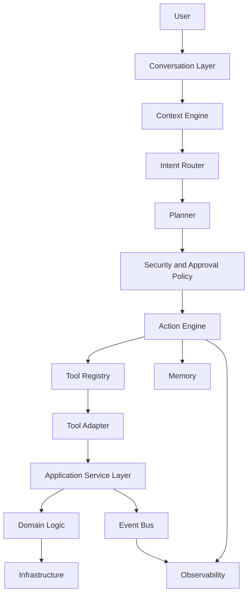
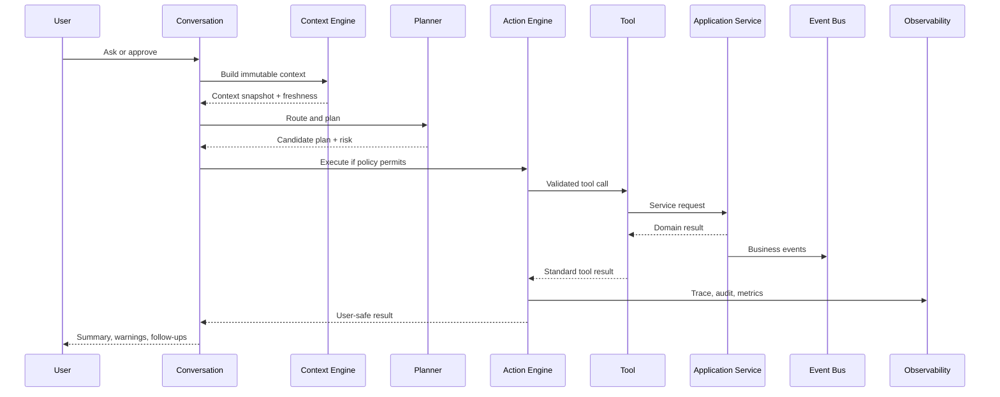

# Volume 4 - System Architecture

Athena is a platform layer over TradeOS application services. It coordinates
conversation, context, planning, tools, actions, memory, events, permissions,
and observability without moving business logic into prompts or tools.

## Major Subsystems

| Subsystem | Responsibility | Must not do |
| --- | --- | --- |
| Conversation Layer | User-visible messages, approvals, citations, assistant state | Expose hidden planner/subagent internals |
| Context Engine | Build immutable request context from providers | Make business decisions or mutate data |
| Intent Router | Classify intent, domain, risk, and candidate tools | Authorize or execute actions |
| Planner | Produce a step plan using registered tools | Invent tools or bypass policy |
| Tool Registry | Store tool metadata, schemas, permissions, versions | Execute business logic itself |
| Action Engine | Execute approved tool calls with retries, idempotency, rollback | Trust LLM-only approval or risk claims |
| Memory | Read/write durable preferences and facts | Store unattributed or undeletable claims |
| Event Bus | Publish and subscribe to business events | Replace transactional application service behavior |
| Security | Enforce auth, tenant, RBAC, capability, approval, abuse policy | Delegate enforcement to prompts |
| Observability | Emit traces, logs, metrics, cost, audit records | Leak secrets, prompts, or unnecessary PII |
| Plugin Framework | Govern future third-party capabilities | Allow unreviewed arbitrary execution |
| Application Service Layer | Execute TradeOS business behavior | Allow direct LLM/database access |

## Component Diagram

## Request Lifecycle

## Architectural Invariants

- Athena never directly opens Prisma, SQL, Supabase, storage, queues, or
  infrastructure clients.
- Tools are adapters over application services, not business-rule owners.
- Application services enforce domain permissions, lifecycle transitions,
  tenant boundaries, validation, transactions, and events.
- The Action Engine handles idempotency, timeout, retry, approval, and result
  normalization.
- Context snapshots are immutable per request. Later provider updates require a
  new context version.
- Every consequential action has actor, organization, permission decision,
  input schema version, output schema version, action ID, telemetry ID, and
  audit trail.
