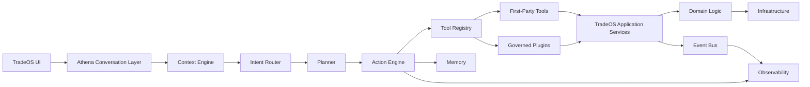
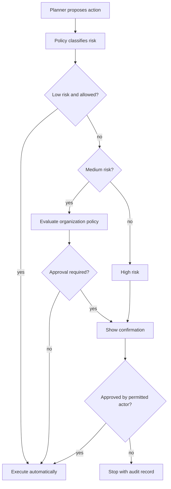

# Athena Diagrams

## Platform Components



## Approval Gate



## Business Lifecycle Events


## Service Boundary

```text
Athena
  -> registered tool
    -> TradeOS application service
      -> domain logic and validation
        -> infrastructure through approved service dependencies
```

Any design that routes around this boundary is not Athena-compliant.
